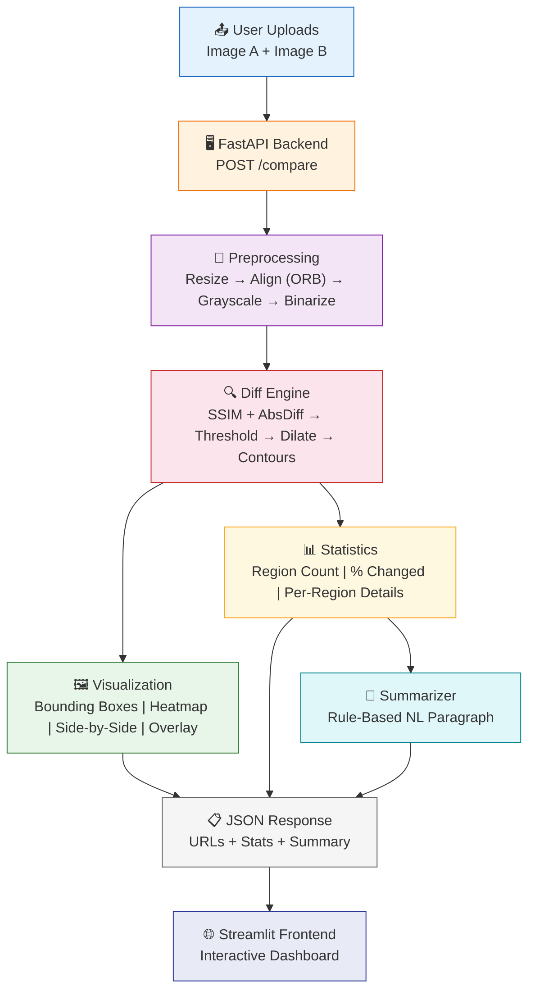

# CAD Review Studio — AI-Based CAD Revision Review

A complete Python system that compares two CAD drawing versions, detects differences, generates rich visualizations, computes statistics, and produces a natural language summary — all running fully offline with zero external API dependencies.

## Problem Statement

In engineering and manufacturing workflows, CAD drawings undergo frequent revisions. Manually comparing two versions of a complex technical drawing to identify changes is:
- **Time-consuming** — Engineers spend significant time visually scanning large drawings for subtle differences.
- **Error-prone** — Small changes in dimensions, annotations, or line positions are easily missed by human reviewers.
- **Unscalable** — As projects grow, the number of revision comparisons grows quadratically.

This tool automates the entire comparison workflow: upload two drawing revisions, and within seconds receive a highlighted visualization of every change, quantitative statistics, and a plain-English summary describing what changed and where.

## Architecture



## Project Structure

```
cad-review-studio/
├── backend/
│   ├── main.py              # FastAPI app, POST /compare endpoint
│   ├── preprocessing.py     # Resize, align (ORB), binarize (Otsu)
│   ├── diff_engine.py       # SSIM diff + contour extraction
│   ├── visualization.py     # Bounding boxes, heatmap, overlay, side-by-side
│   ├── stats.py             # Statistics computation
│   ├── summarizer.py        # Rule-based NL summary generator
│   └── models.py            # Pydantic response schemas
├── frontend/
│   └── app.py               # Streamlit interactive UI
├── sample_images/           # Place sample CAD image pairs here
├── outputs/                 # Generated visualizations saved here
├── requirements.txt         # Python dependencies (all free)
├── Dockerfile               # Docker containerization
├── README.md                # This file
└── .env.example             # Environment config (no API keys needed)
```

## Setup Instructions

### Prerequisites

- Python 3.9 or higher
- pip package manager

### 1. Clone and Navigate

```bash
cd cad-review-studio
```

### 2. Create Virtual Environment

```bash
python -m venv venv

# On Windows:
venv\Scripts\activate

# On macOS/Linux:
source venv/bin/activate
```

### 3. Install Dependencies

```bash
pip install -r requirements.txt
```

### 4. Run the Backend (FastAPI)

```bash
uvicorn backend.main:app --reload --port 8000
```

The API will be available at `http://localhost:8000`. Interactive docs at `http://localhost:8000/docs`.

### 5. Run the Frontend (Streamlit)

In a separate terminal (with the venv activated):

```bash
streamlit run frontend/app.py
```

The web UI will open at `http://localhost:8501`.

### 6. Using Docker (Alternative)

```bash
# Build the image
docker build -t cad-review-studio .

# Run the container
docker run -p 8000:8000 cad-review-studio
```

## API Usage

### Endpoint: `POST /compare`

Upload two images as multipart form data:

```bash
curl -X POST http://localhost:8000/compare \
  -F "image_a=@sample_images/drawing_v1.png" \
  -F "image_b=@sample_images/drawing_v2.png"
```

### Response Example

```json
{
  "image_a_url": "/outputs/a1b2c3d4_original_a.png",
  "image_b_url": "/outputs/a1b2c3d4_original_b.png",
  "diff_visualization_url": "/outputs/a1b2c3d4_side_by_side.png",
  "highlighted_regions_url": "/outputs/a1b2c3d4_highlighted.png",
  "heatmap_url": "/outputs/a1b2c3d4_heatmap.png",
  "overlay_url": "/outputs/a1b2c3d4_overlay.png",
  "statistics": {
    "region_count": 4,
    "percent_changed": 8.7,
    "total_area_changed": 45230,
    "regions": [
      {"bbox": [120, 340, 85, 60], "area": 5100, "location": "bottom-right"},
      {"bbox": [50, 20, 40, 30], "area": 1200, "location": "top-left"},
      {"bbox": [300, 250, 25, 20], "area": 500, "location": "center"},
      {"bbox": [180, 400, 15, 12], "area": 180, "location": "bottom-center"}
    ]
  },
  "summary": "The comparison identified four changed regions between the two drawings. The most significant modification is a component modification in the bottom-right area. This is followed by the removal or addition of a line segment in the top-left area. Minor annotation adjustments were also detected near the center. Overall, approximately 8.7% of the drawing area was affected by these changes."
}
```

## Advanced Features

Beyond the base requirements, the upgraded project now includes:

- OCR-based text and dimension detection using pytesseract, with graceful fallback when OCR is unavailable.
- Severity scoring per region and overall change severity for faster review triage.
- Confidence scoring that combines SSIM, absolute-difference, and OCR evidence.
- Downloadable PDF comparison reports containing images, statistics, text changes, and the generated summary.
- Improved visual annotations with colored arrows, severity-based labels, and a legend.

## Design Decisions

### (a) Why Binarization + Dilation for CAD Drawings

CAD drawings are fundamentally different from natural photographs:

| Property | Natural Photos | CAD Drawings |
|---|---|---|
| Content density | Dense texture everywhere | Sparse lines on white |
| Edge characteristics | Soft gradients | Sharp, thin lines (1-3px) |
| Background | Variable, textured | Uniform white/light |
| Noise profile | Sensor noise throughout | Anti-aliasing at edges |

**Binarization** (Otsu's thresholding) is essential because:
- It eliminates background noise, scanner artifacts, and anti-aliasing gradients that would create false-positive diff regions.
- CAD drawings are inherently binary (line vs. background), so binarization recovers the true signal without information loss.
- Without it, SSIM detects differences in background gray levels between two scans of the *same* drawing.

**Morphological dilation** is critical because:
- When a CAD line shifts by a few pixels, the diff produces two parallel thin streaks (old position and new position).
- Without dilation, `findContours` fragments each streak into dozens of tiny disconnected contours, each below the noise threshold.
- A 5×5 dilation kernel bridges these nearby fragments into one coherent region that correctly represents "this line moved."
- This is the single most important step for getting meaningful region counts from CAD drawings.

### (b) Why Rule-Based Summarization Over LLM APIs

The summary generator uses handcrafted sentence templates with random variation — a deliberate engineering decision, not a limitation:

| Factor | Rule-Based (This Project) | LLM API (GPT-4, etc.) |
|---|---|---|
| **Reliability** | 100% uptime, zero failure modes | Subject to API outages, rate limits |
| **Cost** | $0, always | $0.01-0.10 per call, accumulates |
| **Latency** | < 1ms | 1,000-5,000ms |
| **Privacy** | Fully offline, no data leaves the machine | Sends drawing descriptions to third-party servers |
| **Determinism** | Reproducible outputs for audit trails | Non-deterministic, different each call |
| **Deployment** | Works in air-gapped environments | Requires internet access |

For an industrial CAD comparison tool where the input is structured numerical data (region count, coordinates, percentages), the summary task is well-bounded and does not require the open-ended reasoning capabilities of an LLM. The rule-based approach produces grammatically correct, contextually appropriate summaries that are perfectly adequate for the use case — and it does so with zero external dependencies, zero latency, and zero cost.

## License

This project is provided for educational and demonstration purposes.
